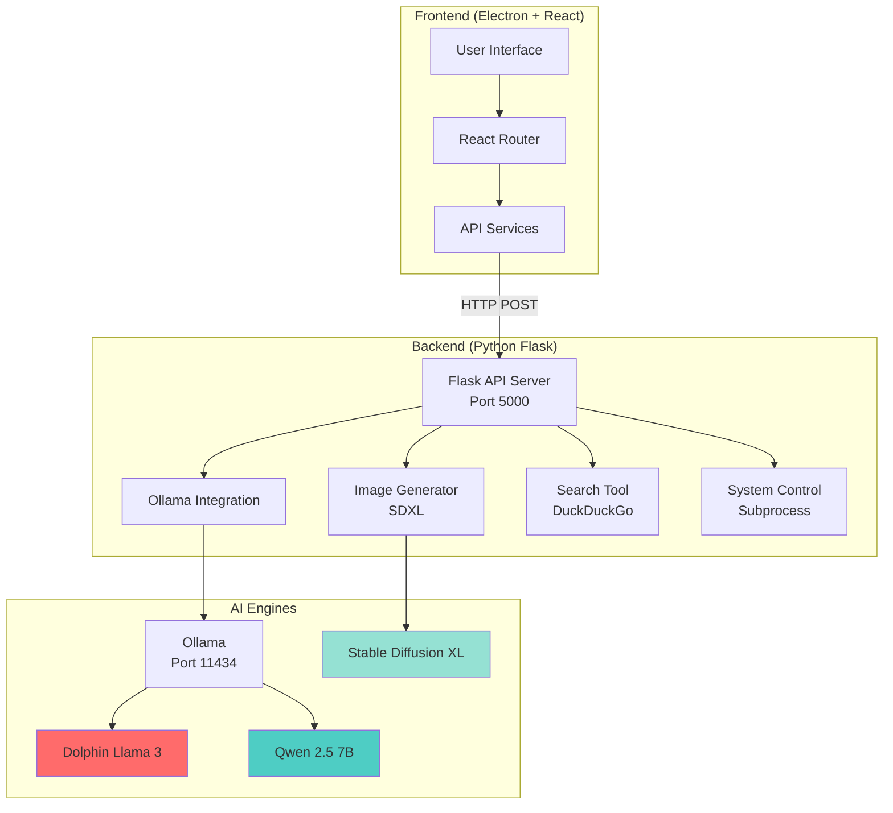
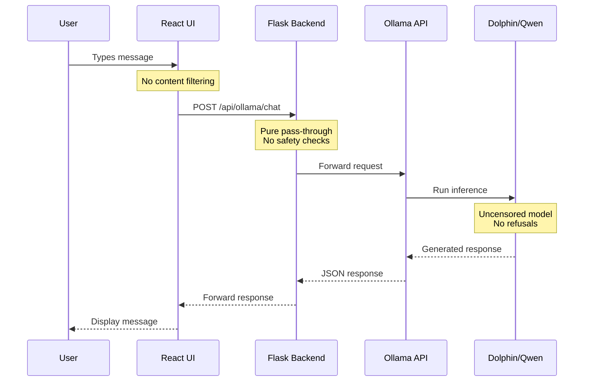
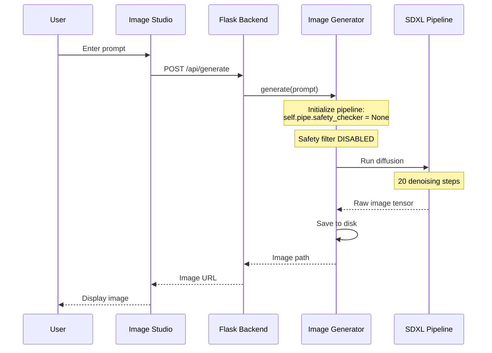
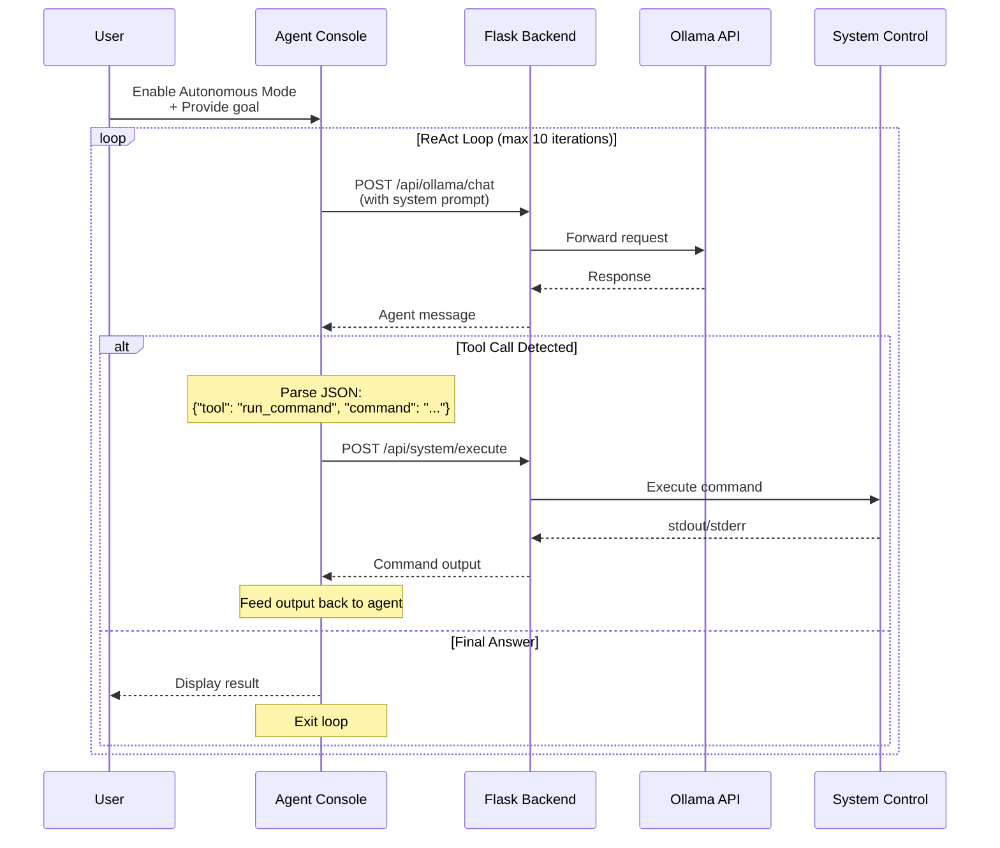

# LUNA NEXUS: Deployment & Architecture Guide


## 📋 Table of Contents

- [Overview](#overview)
- [System Requirements](#system-requirements)
- [Installation Guide](#installation-guide)
- [Deployment Process](#deployment-process)
- [Architecture & Data Flow](#architecture--data-flow)
- [Features](#features)
- [Troubleshooting](#troubleshooting)

---

## 🎯 Overview

Luna-Dolph-AI is a **local-first, unrestricted AI desktop application** that combines:

- **Uncensored Local LLMs** (Dolphin Llama 3, Qwen 2.5 7B via Ollama)
- **Uncensored Image Generation** (SDXL with disabled safety filters)
- **Real Web Search** (DuckDuckGo integration)
- **Autonomous Agent Mode** (ReAct loop for terminal control)
- **System Control** (Execute commands and scripts)

**Privacy-First**: All AI processing happens locally on your machine. No data sent to cloud services (except optional Gemini API).

---

## 💻 System Requirements

### Minimum Requirements

- **OS**: Windows 10/11 (64-bit)
- **RAM**: 8 GB (16 GB recommended for image generation)
- **Storage**: 20 GB free space
- **CPU**: Modern multi-core processor (Intel i5/AMD Ryzen 5 or better)

### Recommended for Best Performance

- **GPU**: NVIDIA GPU with 6+ GB VRAM (for fast SDXL image generation)
- **RAM**: 16+ GB
- **Storage**: SSD with 30+ GB free space

### Required Software

1. **Node.js** (v18 or higher) - [Download](https://nodejs.org/)
2. **Python** (3.10 or 3.11) - [Download](https://www.python.org/)
3. **Ollama** - [Download](https://ollama.ai/)
4. **Git** (optional, for cloning) - [Download](https://git-scm.com/)

---

## 📦 Installation Guide

### Step 1: Install Dependencies

#### 1.1 Install Ollama

```powershell
# Download and install Ollama from https://ollama.ai/
# After installation, pull required models:
ollama pull dolphin-llama3
ollama pull qwen2.5:7b
```

#### 1.2 Verify Ollama

```powershell
ollama list
# Should show: dolphin-llama3 and qwen2.5:7b
```

### Step 2: Set Up the Project

#### 2.1 Clone or Extract Project

```powershell
# If using Git:
git clone <repository-url>
cd luna.dolph.main

# Or extract the ZIP file to C:\Users\YourName\luna.dolph.main
```

#### 2.2 Install Frontend Dependencies

```powershell
npm install
```

#### 2.3 Set Up Python Backend

```powershell
cd backend
python -m venv venv
.\venv\Scripts\activate
pip install -r requirements.txt
cd ..
```

### Step 3: Configure API Keys (Optional)

Create `.env.local` in the project root:

```env
GEMINI_API_KEY=your_gemini_api_key_here
VERTEX_API_KEY=your_vertex_api_key_here

**IMPORTANT**: After installation, you MUST use the launcher script:

```powershell
# From project directory:
.\run-luna-full.bat
```

This script:

1. Starts the Python Flask backend on `http://localhost:5000`
2. Launches the installed Electron app

**Note**: The desktop shortcut will NOT work without the backend running. Always use `run-luna-full.bat`.

---

### Alternative: One-Click Dev Launcher

For development/testing without building:

```powershell
.\run-luna-full.bat
```

If the app is not installed, this will automatically run in dev mode (`npm run dev`).

---

## 🏗️ Architecture & Data Flow

### System Architecture



### Unrestricted Chat Flow (Dolphin/Qwen)



### Uncensored Image Generation Flow



### Autonomous Agent Mode (ReAct Loop)



---

## ✨ Features

### 1. **Luna Console**

- Chat interface with multiple models
- File attachments support
- Chat history management
- Models: Gemini 3 Pro, Dolphin Llama 3, Qwen 2.5 7B

### 2. **Agent Console** (Autonomous Mode)

- Create custom agents with specific personas
- **Autonomous Mode**: Agents can execute commands automatically
- ReAct loop: Reason → Act → Observe → Repeat
- Live telemetry visualization

### 3. **Image Studio**

- Local SDXL image generation
- **Uncensored**: Safety checker disabled
- Negative prompts support
- Multiple aspect ratios (1:1, 16:9, 9:16, 4:3, 3:4)

### 4. **Grounded Search**

- Real-time web search via DuckDuckGo
- No API key required
- Cited sources

### 5. **System Control**

- Execute shell commands
- Run Python scripts
- Manual execution via "Run" button on code blocks
- Autonomous execution in Agent Mode

### 6. **Red Team Ops**

- Documentation for advanced techniques
- **Architecture Documentation**: `architecture_and_workflow.md`
- **Verification Guide**: `walkthrough.md`
- **Implementation Plan**: `implementation_plan.md`

---

## 🔒 Security & Privacy

- **Local-First**: All AI processing happens on your machine
- **No Telemetry**: No data sent to external servers (except optional Gemini API)
- **Unrestricted**: No content filtering or censorship
- **Air-Gap Compatible**: Can run completely offline (except web search)

---

## 📝 License

MIT License - See LICENSE file for details

---

## 🙏 Acknowledgments

- **Ollama** - Local LLM runtime
- **HuggingFace** - SDXL model
- **DuckDuckGo** - Search API
- **Electron** - Desktop framework
- **React** - UI framework

---

**Built with ❤️ for unrestricted AI exploration**
